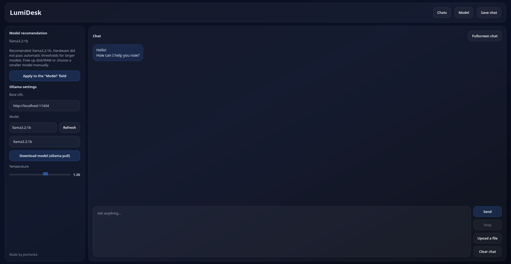
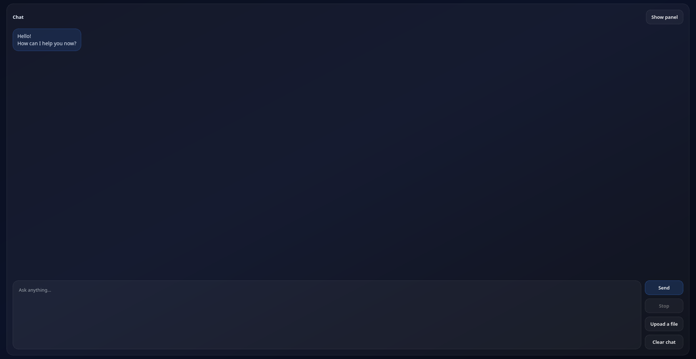

# LumiDesk

> Modern desktop GUI client for Ollama with hardware-aware model recommendations, local-first workflow, and plugin-ready architecture.


---


```md

```

---

## Screenshots

### Main window



### Chat Interface



---

## Installation

### Windows

Download Ollama from their official web site and install it
Download LumiDesk.exe from GitHub releases

### Linux

Download Ollama from their official web site and install it
Download LumiDesk.bin from GitHub releases or using git clone

then

```bash
cd ~/Folder-with-LumiDesk
chmod +x LumiDesk.bin
./LumiDesk.bin
```

---

## Requirements

* Python 3.11+
* Ollama installed
* Recommended: NVIDIA GPU for larger models

---

## Roadmap

* [x] Chat UI
* [x] Hardware detection
* [x] Automatic model recommendation
* [x] Model download support
* [x] Chat saving/loading
* [x] Streaming responses
* [ ] Markdown rendering
* [ ] Plugin API
* [ ] OCR integration
* [ ] Vision model support
* [ ] RAG support
* [ ] Voice features

---

## Windows Defender Warning

> [!WARNING]
> LumiDesk is currently an unsigned open-source application.
>
> Windows Defender or SmartScreen may warn about the executable because it has no digital signature and low reputation.
>
> If you prefer:
>
> * inspect the source code manually
> * run the `.py` version directly
> * build the executable yourself

---


## Building Executable

### PyInstaller

```bash
pip install pyinstaller
pyinstaller --onefile --windowed main.py
```

---


